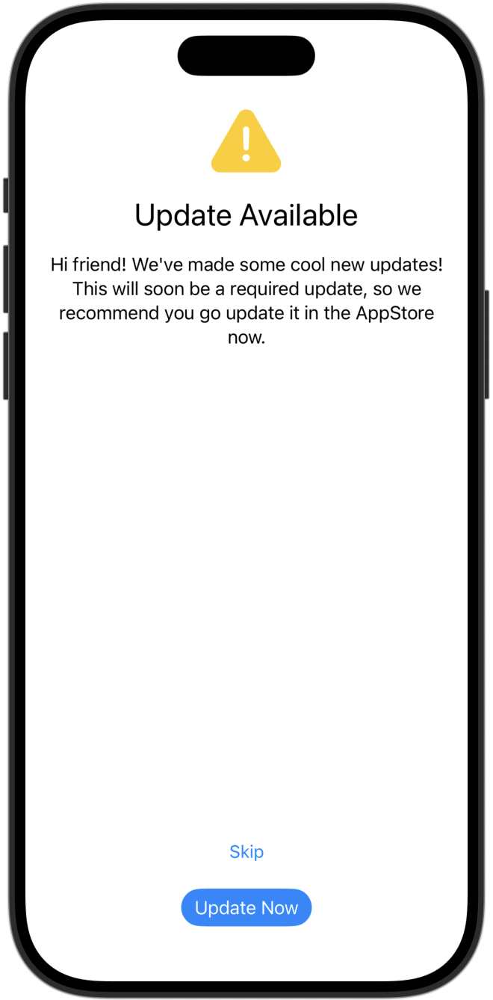
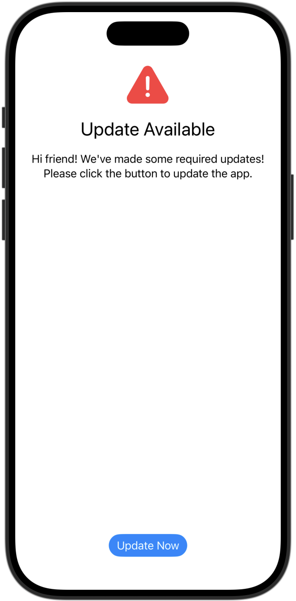
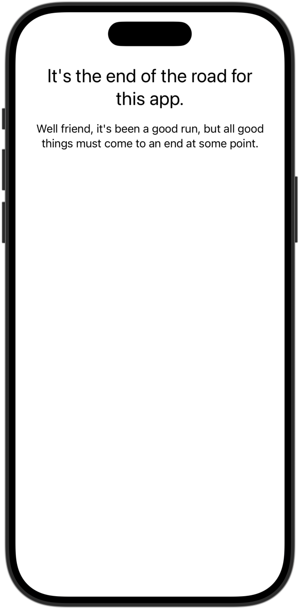

# VersionLockout

Easily stop users from keeping old versions of your app around for a while.

## Mobile is different

Remember the days when you got software on a disk and installed it to your computer manually? Mobile, unfortunately, is still a little like that. Once the code is out there… it's out there. You can't simply revert the branch and redeploy a pipeline. Apple needs to review and approve the changes, then you need to get the user to download it!

## How does this package help?

If the root view is wrapped by the `VersionLockoutView`, you don't have to think about version lockout. This will take care of it for you including giving you built in views for when the user should update their app.

## How does it work?

First things first, you'll need an endpoint, a JSON file in an S3 bucket, or even a JSON file on GitHub — that returns the lockout information for your app. The shape of that data will look like the following:

```json
{
    "recommendedVersion": "2022.08.25",
    "requiredVersion": "2022.08.25",
    "updateUrl" : "https://apps.apple.com/the-link-to-your-app",
    "eol": false,
    "message": "this message is optional and is only used for the end of life for the app"
}
```

Next, you will add the package to your app using Swift Package Manager (SPM).
### Add the package to your app

To add this package to your app, use [Swift Package Manager](https://developer.apple.com/documentation/xcode/adding-package-dependencies-to-your-app). Be sure to add VersionLockout to your app target when you add the dependency.

### Add it to your view

Once the dependency has been added to your project, you can `import VersionLockout`.
Then wrap your outter most view with the VersionLockoutView and pass in the link to the settings file like in the following example:

```swift
import SwiftUI
import VersionLockout // ADD: this import

@main
struct ExampleApp: App {
    // ADD: VersionLockoutViewModel to your view
    @State var versionLockoutVM = VersionLockoutViewModel(URL(string: "https://github.com/link-to-my-version-data.json")!)
    
    var body: some Scene {
        WindowGroup {
            // WRAP: your main view with VersionLockoutView and pass the view model
            VersionLockoutView(viewModel: versionLockoutVM) {
                ContentView()
            }
        }
    }
}
```

### Uses for each screen

* Recommended update: Gives the user the ability to skip updating their app for a short time (uses the task modifier to check for updates and reminds them).
* Required update: Prevents the user from interacting with the app until the update has been completed.
* EOL Update: Currently, the End Of Life (EOL) option is only useful on the Android side (since the App Store allows you to remove apps from a users device and the Play Store does not). The message parameter is currently only used for this screen.

## Built-in Views

Recommended update (gives the user the ability to skip these updates for a short time):



Required update:



End of Life (Android Only):



### Automatic Refresh for Long-Running Apps

By default, VersionLockout re-checks the version API every **3 hours** when your app returns to the foreground. This ensures long-running apps (e.g., apps that stay open for days) don't miss important version updates.

**How it works:**
- On initial launch, the version check runs immediately
- The last fetch timestamp is stored in UserDefaults
- When the app returns to the foreground (`scenePhase` becomes `.active`), VersionLockout checks if 3 hours have elapsed since the last fetch
- If the interval has passed, a new fetch is triggered automatically

**Custom refresh interval:**
The `refreshInterval` parameter accepts any `Measurement<UnitDuration>`, giving you flexibility in how you specify the interval:
```swift
// 1 hour
@State var vm = VersionLockoutViewModel(
    URL(string: "https://github.com/link-to-my-version-data.json")!,
    refreshInterval: .init(value: 1, unit: .hours)
)

// 30 minutes
@State var vm = VersionLockoutViewModel(
    URL(string: "https://github.com/link-to-my-version-data.json")!,
    refreshInterval: .init(value: 30, unit: .minutes)
)
```

**Disable automatic refresh:**
To effectively disable automatic refresh (check only on launch), set a very large interval:
```swift
@State var versionLockoutVM = VersionLockoutViewModel(
    URL(string: "https://github.com/link-to-my-version-data.json")!,
    refreshInterval: .init(value: 1, unit: .days) // Check once per day
)
```

**Loading state on refresh:**
By default, the loading state (`isLoading`) only shows on the initial load when no status exists yet. Subsequent refreshes happen silently in the background, keeping the current content visible. If you want to show a loading indicator on every refresh:
```swift
@State var versionLockoutVM = VersionLockoutViewModel(
    URL(string: "https://github.com/link-to-my-version-data.json")!,
    showLoadingOnRefresh: true
)
```

### Displaying your own custom views

If you want to display your own view for any status, then the code would look like the following example:

```swift
import SwiftUI
import VersionLockout // ADD: this import

@main
struct ExampleApp: App {
    // ADD: VersionLockoutViewModel to your view
    @State var versionLockoutVM = VersionLockoutViewModel(URL(string: "https://github.com/link-to-my-version-data.json")!)
    
    var body: some Scene {
        WindowGroup {
            // Example of completely custom views for every status
            VersionLockoutView(viewModel: versionLockoutVM) {
                Text("I'm Loading")
            } updateRecommended: { _, _ in 
                Text("Recomend")
            } updateRequred: { _ in 
                Text("Required")
            } endOfLife: { _ in
                Text("I'm EOL")
            } upToDate: {
                // Your normal app view goes here
                Text("I'm up to date")
            }
        }
    }
}
```

